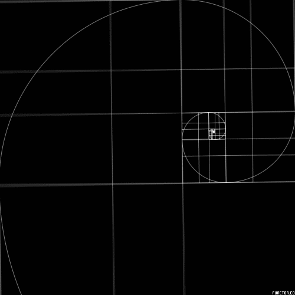

# ISP-Fibonacci-Sequence
***By: Abdelrahman (Abdel) Sayedahmed***

### A Brief History

The Fibonacci Sequence was founded by Leonardo Bonacci. The name Fibonacci was given to him by Franco-Italian historian Guillaume Libri and is short for filius Bonacci ('son of Bonacci'). The Fibonacci sequence appears in the book The Book of Calculation by Fibonacci where it is used to calculate the growth of rabbit populations. Fibonacci considers the growth of a rabbit population, assuming that: a newly born breeding pair of rabbits are put in a field; each breeding pair mates at the age of one month, and at the end of their second month they always produce another pair of rabbits; and rabbits never die, but continue breeding forever. Fibonacci posed the puzzle: how many pairs will there be in one year? 

- At the end of the first month, they mate, but there is still only 1 pair.
- At the end of the second month they produce a new pair, so there are 2 pairs in the field.
- At the end of the third month, the original pair produce a second pair, but the second pair only mate to gestate for a month, so there are 3 pairs in all.
- At the end of the fourth month, the original pair has produced yet another new pair, and the pair born two months ago also produces their first pair, making 5 pairs.

At the end of the nth month, the number of pairs of rabbits is equal to the number of mature pairs (that is, the number of pairs in month n – 2) plus the number of pairs alive last month (month n – 1). The number in the nth month is the nth Fibonacci number.

### The purpose of The Fibonacci Sequence

There are many uses to the Fibonacci Sequence in code. In JavaScript, you can use the Fibonacci sequence for tasks like:

- **Algorithmic Challenges:** Many coding challenges and interview questions involve Fibonacci sequences. Implementing algorithms related to Fibonacci can help you practice problem-solving skills. It can improve your math skills.

- **Mathematical and Art Calculations:** Fibonacci numbers appear in various mathematical contexts. You might need them in certain mathematical calculations or simulations. Fibonacci numbers also heavly relates to art ie the golden ratio. The golden ratio has interesting mathematical properties. It appears in various fields, including art, architecture, nature, and design. Some people believe that objects or designs following the golden ratio are more visually appealing. The ratio is also related to the Fibonacci spiral, which is a logarithmic spiral often found in nature.

- **Dynamic Programming:** Fibonacci sequence is often used as an example in dynamic programming. Implementing solutions for Fibonacci problems can help you understand and practice dynamic programming concepts.

    