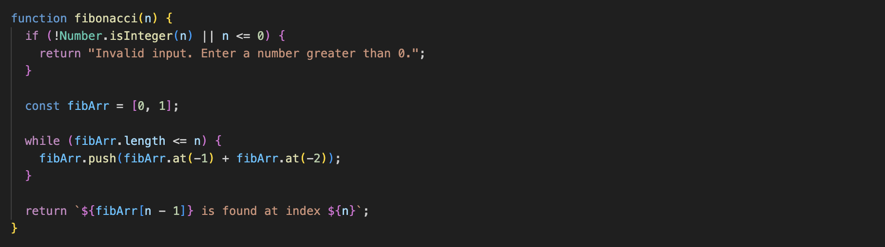
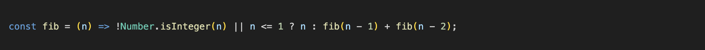

# ISP-Fibonacci-Sequence
***By: Abdelrahman (Abdel) Sayedahmed 10.6 (Nights and Weekends)***

***

### A Brief History

The Fibonacci Sequence was founded by Leonardo Bonacci. The name Fibonacci was given to him by Franco-Italian historian Guillaume Libri and is short for filius Bonacci ('son of Bonacci').In mathematics, the Fibonacci sequence is a sequence in which each number is the sum of the two preceding ones. 0, 1, 1, 2, 3, 5, 8, 13, 21, 34, 55, 89, 144...
The Fibonacci sequence appears in the book The Book of Calculation by Fibonacci where it is used to calculate the growth of rabbit populations. Fibonacci considers the growth of a rabbit population, assuming that a newly born breeding pair of rabbits are put in a field; each breeding pair mates at the age of one month, and the end of their second month they always produce another pair of rabbits; and rabbits never die, but continue breeding forever. Fibonacci posed the puzzle: how many pairs will there be in one year?
- At the end of the first month, they mate, but there is still only 1 pair.
- At the end of the second month, they produce a new pair, so there are 2 pairs in the field.
- At the end of the third month, the original pair produce a second pair, but the second pair only mate to gestate for a month, so there are 3 pairs in all.
- At the end of the fourth month, the original pair produced yet another new pair, and the pair born two months ago also produced their first pair, making 5 pairs.

At the end of the nth month, the number of pairs of rabbits is equal to the number of mature pairs (that is, the number of pairs in month n – 2) plus the number of pairs alive last month (month n – 1). The number in the nth month is the nth Fibonacci number.

***

### The purpose of The Fibonacci Sequence

There are many uses for the Fibonacci Sequence in code. In JavaScript, you can use the Fibonacci sequence for tasks like:

- **Algorithmic Challenges:** Many coding challenges and interview questions involve Fibonacci sequences. Implementing algorithms related to Fibonacci can help you practice problem-solving skills. It can improve your math skills.

- **Mathematical and Art Calculations:** Fibonacci numbers appear in various mathematical contexts. You might need them in certain mathematical calculations or simulations. Fibonacci numbers also heavily relate to art ie the golden ratio. The golden ratio has interesting mathematical properties. It appears in various fields, including art, architecture, nature, and design. Some people believe that objects or designs following the golden ratio are more visually appealing. The ratio is also related to the Fibonacci spiral, which is a logarithmic spiral often found in nature.

- **Dynamic Programming:** The Fibonacci sequence is often used as an example of dynamic programming. Implementing solutions for Fibonacci problems can help you understand and practice dynamic programming concepts.

    

***

### Algorithm description 
***First implementation.***

In this function, a single parameter {number} n is accepted. With the single parameter, the function returns the nth in the Fibonacci sequence. The time of the Fibonacci function is O(n). This is because the function uses a loop that iterates n times to generate the Fibonacci sequence up to the nth number. In each iteration of the loop, a constant amount of work is done (pushing a new element to the array), and the loop runs n times. Therefore, the overall time complexity is linear in terms of the input size, which is O(n). The space complexity of the function is also O(n) because it maintains an array (fiber) to store the Fibonacci sequence up to the nth number. The size of this array is directly proportional to the input value of n.

---

***Second Implementation***

This one-liner is similar to the function but instead assumes the sequence 1, 1, 2, 3, 5, 8, 13, 21, 34, 55, 89, 144... In this one-liner, we return n if the number is less than or equal to 1. If the number is greater than 1, the function recursively calls itself with fib(n - 1) and fib(n - 2) and sums the results. This recursion continues until it reaches the base case. However, it's important to note that this recursive implementation has exponential time complexity O(2^n). This is when, for each call, two additional recursive calls are made, leading to an exponential number of function calls. As a result, it may become inefficient for larger values of n.

---

***Third Implementation***

***
### Use Cases
As mentioned before, there are many use cases for the Fibonacci sequence.
- In algorithmic challenges, such as coding challenges and interview questions. Implementing algorithms related to the Fibonacci sequence can demonstrate your problem-solving skills and recursion skills.
- In Mathematical Calculations. If your JavaScript application involves mathematical calculations or simulations where Fibonacci numbers are relevant, you might use the sequence.
- In Design and Aesthetics. The golden ratio, taken from the Fibonacci sequence, is considered aesthetically pleasing and is used in design. If you are working on web design or graphics in JS, you might use the Fibonacci sequence or the golden ratio.

There are many other cases for the Fibonacci sequence in js. Maybe it can also be used for ideal farm breeding like what Bonacci did.

***
### Edge Cases and Concerns
As mentioned before, for the second implementation, there is a chance the function will not give the correct result, for higher n values, because of its time complexity. As for the first implementation, the only concern is large n values because they can cause overflow issues.

***
### Citations
***Formatting***
- https://www.youtube.com/shorts/OZnoTv_8TV4
- https://docs.github.com/en/get-started/writing-on-github/getting-started-with-writing-and-formatting-on-github/basic-writing-and-formatting-syntax
- https://byby.dev/md-image-size
- https://marketplace.visualstudio.com/items?itemName=streetsidesoftware.code-spell-checker

***History and Summarization of Fibonacci***
- https://chat.openai.com/share/0ffd4876-67c2-4e7c-8f15-77060e40f841
- https://en.wikipedia.org/wiki/Fibonacci_sequence#India
- https://en.wikipedia.org/wiki/Fibonacci

***JS Code Links***
- https://chat.openai.com/share/0ffd4876-67c2-4e7c-8f15-77060e40f841
- https://medium.com/developers-writing/fibonacci-sequence-algorithm-in-javascript-b253dc7e320e
- https://stackoverflow.com/questions/20726578/fibonacci-sequence-find-the-number-of-digits-javascript
- https://en.m.wikipedia.org/wiki/Fibonacci_search_technique